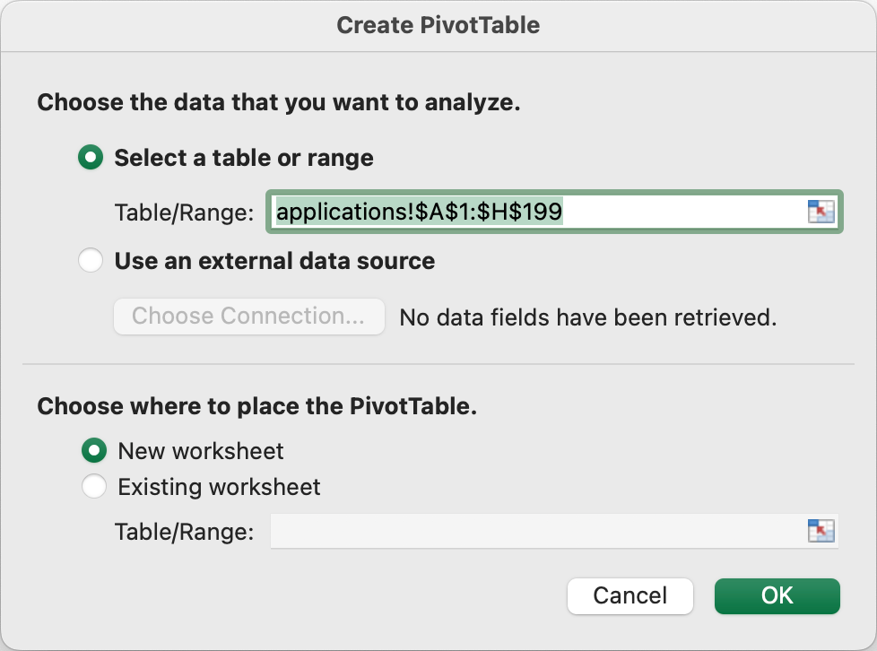
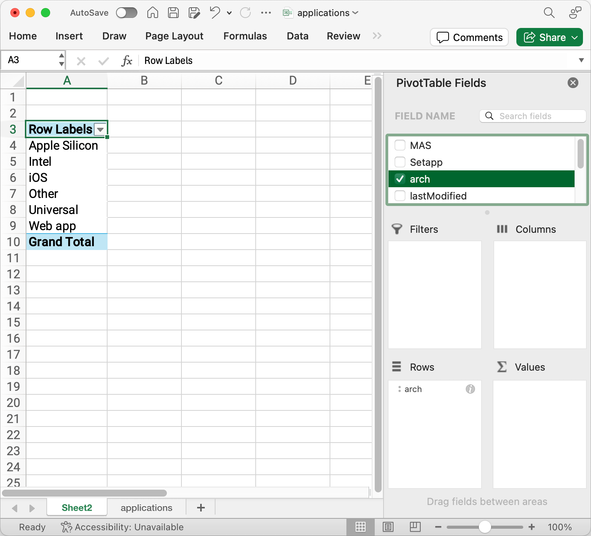
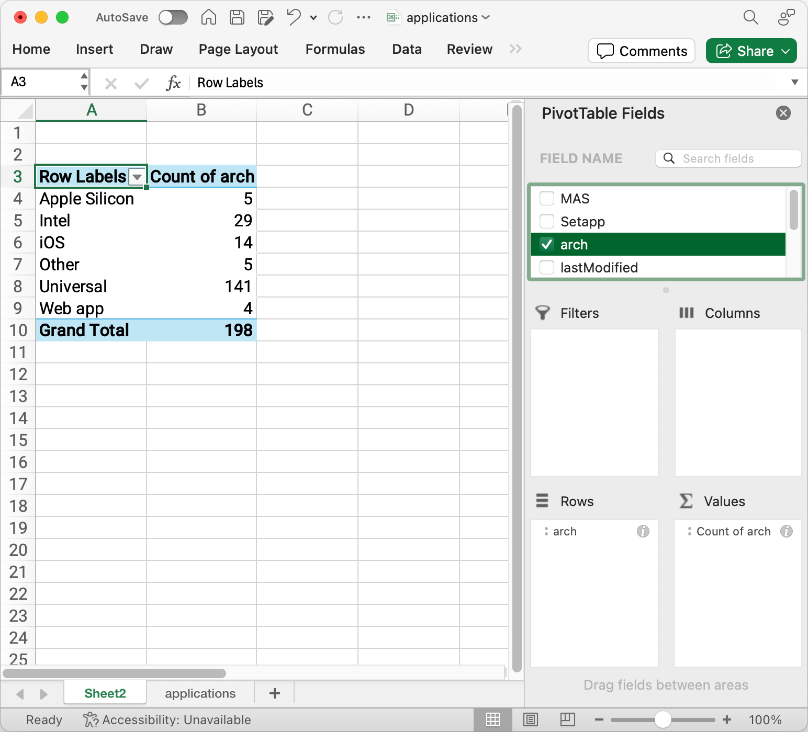
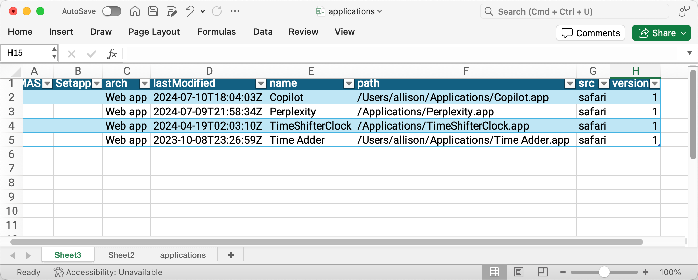

This Tidbit episode of Programming By Stealth is brought to you by Helma van der Linden and is written in the first person.

## Matching Podcast Episode

<audio controls src="https://media.blubrry.com/nosillacast/traffic.libsyn.com/nosillacast/PBS_2024_07_20.mp3?autoplay=0&loop=0&controls=1">Your browser does not support HTML 5 audio 🙁</audio>

You can also <a href="https://media.blubrry.com/nosillacast/traffic.libsyn.com/nosillacast/PBS_2024_07_20.mp3" >Download the MP3</a>

Read an unedited, auto-generated transcript with chapter marks:  <a href="https://podfeet.com/transcripts/PBS_2024_07_20.html">PBS_2024_07_20</a>

---

This article assumes you have followed along with Bart Busschots' [PBS course](https://pbs.bartificer.net) so some concepts will be used without explanation. However, if you are merely interested in the result file and don't care for the details, you might want to skip to the end and help yourself to the script.

## Problem to be solved

When you want to transfer your Mac setup to a new machine or if you want to do a nuke and pave, you always need a list of the applications installed on your machine. This is especially true when you move from an Intel machine to one with Apple Silicon.

Of course, when you are as meticulous as Allison Sheridan, you have an extensive mind map of all your applications and their configurations which is always up to date and right at your fingertips on one of your other Apple devices.

Alas, I am not so meticulous so I usually start with the most important applications, i.e. the ones on top of mind and then the ones I need but haven't installed yet. I always keep my old laptop around to check every once in a while for the things I might have missed.

Sure, Migration Assistant helps a lot, but going from Intel to Apple Silicon I read the advice to NOT migrate applications because they might not work. The advice was to check System Information for the architecture of the installed applications. To access System Information, hold down the Option key, click on the Apple logo in the menu bar, and select System Information.  You can also open System Information from `/System/Applications/Utilities/System Information.app`.

Before we go much further, it's important to note that Apple used to call this app System Profiler. They changed the name but they didn't change it everywhere, so we'll actually need to reference it as System Profiler from the command line.

If any of your applications are listed in System Information (Profiler) as Intel, you need a different version on a Mac with Apple Silicon. If they are listed as Universal, you could transfer the application and it will probably keep on working. However, Migration Assistant doesn't allow you to pick and choose; it's an all-or-nothing selection.

I wanted a list of applications I could filter by some criteria, sort, mark off as complete, and maybe do even more with it. This tidbit will show you how to do just that.

## Getting the information

The first step is to get information similar to what System Information shows in a format that can be used. System Information has a command line interface (CLI) but it still uses the old System Profiler name. Open your Terminal and type:

```bash
system_profiler
```

The output looks something like this
```
Accessibility:

    Accessibility Information:

      Cursor Magnification: On
      Display: Black on White
      Flash Screen: Off
      Mouse Keys: Off
      Slow Keys: Off
      Sticky Keys: Off
      VoiceOver: Off
      Zoom Mode: Full Screen
      Contrast: 0
      Keyboard Zoom: On
      Scroll Zoom: Off

Apple Pay:

      Apple Pay Information:
.......
```

You will see all the content you could look up in the System Information app scroll by in your Terminal. If you scroll up you will see the information about the applications installed. That's the only thing we are interested in so can we reduce the output. Let's check the available properties.

```bash
system_profiler --help

# Output
Usage: system_profiler [-listDataTypes]
       system_profiler [-xml | -json] [-timeout n] [-detailLevel n]
       system_profiler [-xml | -json] [-timeout n] [dataType1 ... dataTypeN]

  -detailLevel n    specifies the level of detail for the report
                      mini = short report (contains no identifying or personal information)
                      basic = basic hardware and network information
                      full = all available information

  -listDataTypes    lists all the available datatypes

  -xml              generates xml output instead of plain text
                    if redirected to a file with the extension ".spx"
                    the file can be opened in System Profiler.app

  -json             generates json output instead of plain text

  -timeout          specifies the maximum time to spend gathering information
                    the default is 180 seconds, 0 means no timeout

  Redirect stderr to /dev/null to suppress progress and error messages.

Examples:

  system_profiler
     Generates a text report with the standard detail level.

  system_profiler -detailLevel mini
     Generates a short report without identifying/personal information.

  system_profiler -listDataTypes
     Shows a list of the available data types.

  system_profiler SPSoftwareDataType SPNetworkDataType
     Generates a text report containing only software and network data.

  system_profiler -xml >MySystem.spx
     Creates a XML file which can be opened by System Profiler.app

```

We can call `-listDataTypes` to find what kind of sections we can filter on.

```bash
system_profiler -listDataTypes | grep 'Application'

# Output
SPApplicationsDataType
```

This gives us the datatype `SPApplicationsDataType` to use if we only want applications. Your output might vary. 

```bash
system_profiler SPApplicationsDataType

# Output
Applications:

    TextEdit:

      Version: 1.19
      Obtained from: Apple
      Last Modified: 07-05-2024, 09:01
      Kind: Universal
      Signed by: Software Signing, Apple Code Signing Certification Authority, Apple Root CA
      Location: /System/Applications/TextEdit.app

    Time Machine:

      Version: 1.3
      Obtained from: Apple
      Last Modified: 07-05-2024, 09:01
      Kind: Universal
      Signed by: Software Signing, Apple Code Signing Certification Authority, Apple Root CA
      Location: /System/Applications/Time Machine.app

    Activity Monitor:

      Version: 10.14
      Obtained from: Apple
      Last Modified: 07-05-2024, 09:01
      Kind: Universal
      Signed by: Software Signing, Apple Code Signing Certification Authority, Apple Root CA
      Location: /System/Applications/Utilities/Activity Monitor.app

........
```

This shows we are on the right track. The `--help` argument also shows that information can be exported to JSON. So we can get the information in a processable form. Save the file to the Desktop for easy access.

```bash
system_profiler SPApplicationsDataType -json > ~/Desktop/applications.json
```

## Convert the information 

With a list of applications in a JSON file, we can use `jq` to process the information and apply all the knowledge Bart provides us with. Let the fun begin.

Because the final statement will be long, we immediately convert it into a file called `parse-applications.jq`.

We will be able to call this file with the following command:

```bash
jq -r -f ./parse-applications.jq ~/Desktop/applications.json
```

Content of `parse-applications.jq`:

First, add some comment to explain what this file does. Your future self will be glad you did. We only want the array of `SPApplicationsDataType`.

```jq
# File to parse the result of an export of the system profiler applications
# system_profiler SPApplicationsDataType -json > ~/Desktop/applications.json
#
# use as jq -r -f parse-applications.jq ~/Desktop/applications.json 
# > ~/Desktop/applications.csv
# in the directory where the `parse-applications.jq` file is stored
 
[."SPApplicationsDataType"[]
]
```

The output would be something like this:
```json
[
  {
    "_name": "Calendar",
    "arch_kind": "arch_arm_i64",
    "lastModified": "2024-05-02T09:37:24Z",
    "obtained_from": "apple",
    "path": "/System/Applications/Calendar.app",
    "signed_by": [
      "Software Signing",
      "Apple Code Signing Certification Authority",
      "Apple Root CA"
    ],
    "version": "11.0"
  },
  {
    "_name": "FaceTime",
    "arch_kind": "arch_arm_i64",
    "lastModified": "2024-05-02T09:37:24Z",
    "obtained_from": "apple",
    "path": "/System/Applications/FaceTime.app",
    "signed_by": [
      "Software Signing",
      "Apple Code Signing Certification Authority",
      "Apple Root CA"
    ],
    "version": "5.0"
  },
  ......
```

From now on only the relevant lines are shown, not the entire content of the file. More to the point: the comments and the `[."SPApplicationsDataType"[]` line will be skipped. 
If you want to test and play along, you can replace the final line with just the `]` with the code in the code block.

Filter out default Apple applications and any helper applications hiding in the Library directories, because they will be installed with the application anyway. We do this by testing for a part of the path and then negating the selection.
In case you're wondering about the last line in this list of filters. It filters out any helper apps that are part of an app. You don't need information about the helper apps, because they will be installed again once you install the main app.

```jq
  | select(.path | contains("/System/Library") | not)
  | select(.path | contains("/System/Applications") | not)
  | select(.path | contains("/usr/local/Cellar") | not)
  | select(.path | contains("/opt/homebrew") | not)
  | select(.path | contains("/Library/Application Support") | not)
  | select(.path | contains("/Library/Containers") | not)
  | select(.path | contains(".app/Contents/") | not)
]
```

If we look at the output now, the apps listed before are gone.

```json
[
  {
    "_name": "iTerm",
    "arch_kind": "arch_arm_i64",
    "info": "3.5.3",
    "lastModified": "2024-07-03T11:08:40Z",
    "obtained_from": "identified_developer",
    "path": "/Applications/iTerm.app",
    "signed_by": [
      "Developer ID Application: GEORGE NACHMAN (H7V7XYVQ7D)",
      "Developer ID Certification Authority",
      "Apple Root CA"
    ],
    "version": "3.5.3"
  },
  {
    "_name": "BBEdit",
    "arch_kind": "arch_arm_i64",
    "info": "15.1.1 (15B26), copyright ©1992-2024 Bare Bones Software, Inc.",
    "lastModified": "2024-06-04T16:55:03Z",
    "obtained_from": "identified_developer",
    "path": "/Applications/BBEdit.app",
    "signed_by": [
      "Developer ID Application: Bare Bones Software, Inc. (W52GZAXT98)",
      "Developer ID Certification Authority",
      "Apple Root CA"
    ],
    "version": "15.1.1"
  },
  .....
```

Then,  rename the field names to something easier to use.

```jq
	| {
		name: ._name, 
		arch: .arch_kind, 
		lastModified: .lastModified, 
		src: .obtained_from, 
		path: .path, 
		version: .version,
	} 
] 

```

The output becomes much more readable.

```json
[
  {
    "name": "iTerm",
    "arch": "arch_arm_i64",
    "lastModified": "2024-07-03T11:08:40Z",
    "src": "identified_developer",
    "path": "/Applications/iTerm.app",
    "version": "3.5.3"
  },
  {
    "name": "BBEdit",
    "arch": "arch_arm_i64",
    "lastModified": "2024-06-04T16:55:03Z",
    "src": "identified_developer",
    "path": "/Applications/BBEdit.app",
    "version": "15.1.1"
  },
.....
```


The `.arch_kind` field contains information about the architecture, but it's not easy to recognize what's what. So let's add a helper function that converts the content of the field into something that can be understood better.

At the top, below the comments and before the first line of filters, we add the function.

This function replaces the content of `.arch_kind` with 'Universal', 'Intel' or 'iOS'. If the content is none of those, it is added without any change. You might wonder why 'iOS', but actually that's what Apple calls it in the System Information app, but it's probably better called 'Apple Silicon'.

```jq
def archType:
	if . == "arch_arm_i64" then "Universal"
	elif . == "arch_i64" then "Intel"
	elif . == "arch_ios" then "iOS"
	else .
	end;
```

With this function we can change the line in the dictionary definition to

```jq
	arch: (.arch_kind | archType), 
```

And the output becomes

```json
[
  {
    "name": "iTerm",
    "arch": "Universal",
    "lastModified": "2024-07-03T11:08:40Z",
    "src": "identified_developer",
    "path": "/Applications/iTerm.app",
    "version": "3.5.3"
  },
  {
    "name": "BBEdit",
    "arch": "Universal",
    "lastModified": "2024-06-04T16:55:03Z",
    "src": "identified_developer",
    "path": "/Applications/BBEdit.app",
    "version": "15.1.1"
  },
  {
    "name": "1Password",
    "arch": "Intel",
    "lastModified": "2024-06-16T07:35:23Z",
    "src": "identified_developer",
    "path": "/Applications/1Password.app",
    "version": "8.10.34"
  },
.....  
```

In hindsight, there are more arch types that can also be converted. So we can extend the function to

```jq
def archType:
	if . == "arch_arm_i64" then "Universal"
	elif . == "arch_i64" then "Intel"
	elif . == "arch_ios" then "iOS"
	elif . == "arch_arm" then "Apple Silicon"
	elif . == "arch_web" then "Web app"
	elif . == "arch_other" then "Other"
	else .
	end;
```

It's nice to know if the application is downloaded from the Mac App Store, from Setapp or somewhere else. So let's add a field for the Mac App Store (MAS) and one for Setapp.

If the application is downloaded from the Mac App Store, the `.obtained_from` field contains 'mac_app_store'. When the application is downloaded from Setapp, it will be in a folder '/Applications/Setapp', so we can check the `.path` field.

```jq
	| {
		name: ._name, 
		arch: (.arch_kind | archType), 
		lastModified: .lastModified, 
		src: .obtained_from, 
		path: .path, 
		version: .version,
		MAS: (.obtained_from | contains("mac_app_store")),
		Setapp: (.path | contains("/Setapp/"))
	} 
] 
```

Output:

```json
.....
  {
    "name": "1Password",
    "arch": "Intel",
    "lastModified": "2024-06-16T07:35:23Z",
    "src": "identified_developer",
    "path": "/Applications/1Password.app",
    "version": "8.10.34",
    "MAS": false,
    "Setapp": false
  },
  {
    "name": "SnippetsLab",
    "arch": "Universal",
    "lastModified": "2024-06-05T09:57:28Z",
    "src": "identified_developer",
    "path": "/Applications/Setapp/SnippetsLab.app",
    "version": "2.4.2",
    "MAS": false,
    "Setapp": true
  },
.....
```

These fields will have a 'true' or 'false' value. Nice, but maybe we can do better. Because we intend to import the final result into a spreadsheet app where you can filter based on columns, it's easier to use blanks for the 'false' value. So, let's convert these boolean values into "yes" and blank respectively. 

We can do this with a function. Add the function directly before or after the 'archType' function in the code.

```jq
def yn:
	if . == true or . == "true" then "yes"
	else ""
	end;
```

We can now change the MAS and Setapp fields to

```jq
		MAS: (.obtained_from | contains("mac_app_store") | yn),
		Setapp: (.path | contains("/Setapp/") | yn)
```

Output now becomes

```json
.....
 {
    "name": "1Password",
    "arch": "Intel",
    "lastModified": "2024-06-16T07:35:23Z",
    "src": "identified_developer",
    "path": "/Applications/1Password.app",
    "version": "8.10.34",
    "MAS": "",
    "Setapp": ""
  },
  {
    "name": "SnippetsLab",
    "arch": "Universal",
    "lastModified": "2024-06-05T09:57:28Z",
    "src": "identified_developer",
    "path": "/Applications/Setapp/SnippetsLab.app",
    "version": "2.4.2",
    "MAS": "",
    "Setapp": "yes"
  },
.....
```

Are we done? Not yet. It's nice to sort the applications from old to new. Old applications might be lingering around but you never use them anymore, so having them together makes it easier to spot them.
More or less the same argument goes for the most recent apps. They might be a test install you forgot to uninstall but you don't want to reinstall.

So let's sort on `.lastModified`

```jq
] 
| sort_by(.lastModified)
```

By now we have an array of dictionaries, but we want to convert to a table with the field names as column headers and convert to CSV.

Credit where credit is due. I found the solution in [a Stackoverflow answer](https://stackoverflow.com/questions/32960857/how-to-convert-arbitrary-simple-json-to-csv-using-jq).

First, find the column names. We need to map the keys, add the individual arrays together and deduplicate the results. Add this to a `$cols` variable.

```jq
| (map(keys) | add | unique) as $cols | $cols
```

Output:
```bash
[
  "MAS",
  "Setapp",
  "arch",
  "lastModified",
  "name",
  "path",
  "src",
  "version"
]
```

Note that the `unique` filter also sorts the keys.

Now we have to do the same for the rows. Map the current row, use the $cols as keys, and wrap the row values in an array.

```jq
   map(. as $row | $cols | map($row[.]))
```

If this is combined, we get an array of arrays. The first array contains the column names and the other arrays contain the values of the dictionaries.
Now you can expand the array and parse it through the `@csv` filter to get a CSV file.

```jq
] 
| sort_by(.lastModified)
|
    (map(keys) | add | unique) as $cols | $cols, 
   	map(. as $row | $cols | map($row[.]))
  []
| @csv
```

Then the output becomes something like:

```csv
"MAS","Setapp","arch","lastModified","name","path","src","version"
"","","Intel","2018-07-27T21:24:11Z","Mountain","/Applications/Mountain.app","identified_developer","1.6.6"
"yes","","Universal","2023-03-16T08:12:02Z","GarageBand","/Applications/GarageBand.app","mac_app_store","10.4.8"
"yes","","Universal","2023-03-16T08:12:29Z","Speedtest","/Applications/Speedtest.app","mac_app_store","1.27"
"","","Intel","2023-03-29T09:58:19Z","OBS","/Applications/OBS.app","identified_developer","29.0.2"
"","","Intel","2023-03-29T12:58:14Z","Signal","/Applications/Signal.app","identified_developer","6.12.0"
```

If you go through this list, you might find more applications to filter out, but that's left as an exercise.

## Full script

As promised, this section will contain the full script and the commands you need to get the applications in a CSV file.

`parse-applications.jq`:

```jq
# File to parse the result of an export of the system profiler applications
# system_profiler SPApplicationsDataType -json > ~/Desktop/applications.json
#
# use as jq -r -f parse-applications.jq ~/Desktop/applications.json > ~/Desktop/applications.csv

def yn:
	if . == true or . == "true" then "yes"
	else ""
	end;
  
def archType:
	if . == "arch_arm_i64" then "Universal"
	elif . == "arch_i64" then "Intel"
	elif . == "arch_ios" then "iOS"
	elif . == "arch_arm" then "Apple Silicon"
	elif . == "arch_web" then "Web app"
	elif . == "arch_other" then "Other"
	else .
	end;


[."SPApplicationsDataType"[] 
	| select(.path | contains("/System/Library") | not)
	| select(.path | contains("/System/Applications") | not)
	| select(.path | contains("/usr/local/Cellar") | not)
	| select(.path | contains("/opt/homebrew") | not)
	| select(.path | contains("/Library/Application Support") | not)
	| select(.path | contains("/Library/Containers") | not)
	| select(.path | contains(".app/Contents/") | not)
	| select(.path | contains(".app/Contents/") | not)
	| {
		name: ._name, 
 		arch: (.arch_kind | archType), 
		lastModified: .lastModified, 
		src: .obtained_from, 
		path: .path, 
		version: .version,
		MAS: (.obtained_from | contains("mac_app_store") | yn),
		Setapp: (.path | contains("/Setapp/") | yn)
	} 
] 
| sort_by(.lastModified)
| 
	(map(keys) | add | unique) as $cols | $cols, 
   	map(. as $row | $cols | map($row[.]))
  []
| @csv
```

All the commands together to export the application information and subsequently parse the JSON file.

```bash
system_profiler SPApplicationsDataType -json > ~/Desktop/applications.json

jq -r -f parse-applications.jq ~/Desktop/applications.json > ~/Desktop/applications.csv
```

You now have a file `applications.csv` on your Desktop for import in a spreadsheet app like Excel or Numbers.

## Analyze with a Pivot Table

Allison here now. The CSV file is easy enough to open with any spreadsheet application, but you still might be overwhelmed with data. Creating a pivot table from a set of data is a great way to turn that data into information. I'll use Excel as the spreadsheet but the concept is identical in Google Sheets or Apple Numbers.

First, simply open the CSV file in Excel, and save it as a native Excel file. Our dataset will behave properly but if you're trying this with any other data set, ensure that every single column has a row title. If one is missing, no data from that column and after will be included in the pivot table. 

Select any cell in the worksheet.  From the menus, choose Data → Summarize with Pivot Table.  You'll be asked to choose the dataset range (which should be all of your data) and where to put the pivot table. Keep the default of new workshet.



This will create a new sheet in your workbook with an empty pivot table and the pivot table fields on the right.


For this example, let's say we want to know how many apps are each type of architecture. In the Field Name section, click the box next to the field name "arch", and it will immediately jump down into the Rows box below.



The pivot table now shows a list of all of the architectures it found, but we need to know how _many_ of each it found. Now drag (don't click) the "arch" down into the box labeled Sum (∑) Values. Now you'll see "Count of arch" at the top of a new column and the number of of apps for  each architecture found.



While this is a good overview of what you have on your system, a pivot table's job is to help you understand and get answers to the questions it raises. For example, looking at the data we see in the screenshot, one might ask what those 4 web apps are.  We don't have to go back to the main table and filter on the architecture column for web apps. Simply double click on the number for the row you're curious about, such as the 4 next to Web apps.  This will create a new sheet in your spreadsheet with all of the data for just those four web apps.




I recommend starting to name your sheets at this point because your curiosity will get ahead of you before long because it's so easy to ask for more information in this way.

### Caveats

The sheet we just created is a standalone, editable sheet of data. If you change anything here, nothing will change in the original sheet. Likewise if you change any data in the original sheet, this will not be updated.

The other thing to know is that pivot tables do not automatically update when their source sheet is updated. If you make changes on the source sheet, you must manually refresh the pivot table. In Excel, select any cell in the pivot table and in the menus go to Data → Refresh.

This certainly isn't an exhaustive explanation of how to create pivot tables but hopefully you'll have a little taste of what they can do and begin to experiment by adding more columns to your pivot table to learn more about your data. If you make a mess, simply delete the sheet for the pivot table and start again.
